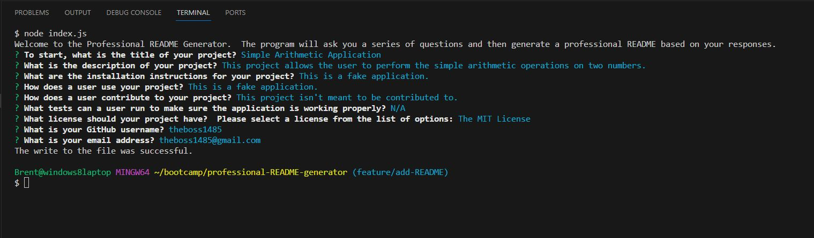

# Professional README Generator

## Description 

My motivation for building this project was to gain experience with using both the inquirer package and NodeJS.  I built this project so that I could write a meaningful JavaScript application and then learn how to invoke it via the command line, using NodeJS.  This project solves the problem of a programmer needing to generate professional READMEs for his or her projects more quickly.  This project lets the user enter in their responses to several questions and then creates a markdown file with those responses.  In this project, I learned the basics of using the inquirer module, and how to run an application from the command line using NodeJS.  

## Table of Contents (Optional)

This README isn't that long, so N/A.

## Notes to Grader

This is the README that explains the function of this README Generator application.  The sample README that is to be included in this application's files is under the name generated-README.md.  Additionally, I decided to keep the file explorer open for the walkthrough video so that it would show the generated-README.md file appearing there successfully, and also so that I didn't have to pull it open to be able to open the generated README.

I included the walkthrough video in the GitHub repository.  I did this because I wasn't 100 percent sure what was being asked for.  In the "How to Submit the Challenge" section on the Module 9 Challenge page, the instructions say I need to submit the walkthrough video for review.  I wasn't completely sure if this meant just the Google Drive or YouTube link to the video, or if it meant the actual video file, so I have included the video file in the GitHub repository and also submitted the video link on the submission page, just in case.

After I created and submitted the walkthrough video, I realized that I had mixed camel case file names (generateMarkdown) and dashed file names (generate-markdown).  Therefore, I went back and renamed the files to use dashes.  As such some of my files have slightly different names than they did in the walkthrough video.  If this is a problem, let me know and I can redo the video.  Similarly, after I had submitted the video, I thought of a couple of slight changes I could make to the syntax and wording of the generated README.  Once again, if this is an issue, let me know and I can redo the video.

## Installation

To get the development environment running for this application, first, make sure Node.js is installed on your computer.  Node.js can be downloaded here: [https://nodejs.org/en](https://nodejs.org/en). I recommend downloading the LTS version of Node.js that is on the left side of the page I just gave a link to. Next, clone my GitHub repository with the "git clone" command.  Then, navigate to the project folder in the command line and type "npm i inquirer@8.2.4", without the quote marks.  This installs the inquirer package.

## Usage

To view the code for this application, please go to my GitHub profile here: [https://github.com/theboss1485/professional-README-generator](https://github.com/theboss1485/professional-README-generator).

After following the installation instructions above, type "node index.js" in Git Bash, without the quote marks.  This will start the application and the system will begin by asking the user a series of questions.  Type an answer to each question, or else select an answer from the list of options, and press Enter.  After the program has finished asking questions, check the project's folder.  You should see a new file titled generated-README.md.  Feel free to rename this file.  I decided not to name the file README.md because running the program would then overwrite this current README.md.

Here is a screenshot of what a successful run of the README generator would look like in the terminal: 

## Walkthrough Video Explanation

To view the walkthrough video for the the README generator please use the following link: [https://drive.google.com/file/d/1REPEG3-ukwRHWwRWg_0pR1eTt0MH3PoC/view](https://drive.google.com/file/d/1REPEG3-ukwRHWwRWg_0pR1eTt0MH3PoC/view).  I have also included the walkthrough video in this repository inside of the videos folder, which is inside of the assets folder.

The first thing I do in the walkthrough video is enter "node index.js" into the command line.  This starts the application.  The application begins by asking the user what the title of the application is that the README will be generated for.  After the user enters a title, the application asks what the description of the application is.  Once the user enters this, the system asks more questions, one at a time, and waits for user input on each one.  The system asks for installation instructions, usage instructions, how another user would contribute to the project, and also for tests that the other users would run to test the application in question. For the tests question, I press Enter to accept the default value that is in parentheses, which is N/A.  Next, the system asks what license the application should be under.  The user can select a license from the list of options using the Up and Down arrow keys and confirm it using the Enter key.  The application then asks for the user's GitHub username and email address.  Once the user enters those, the application generates the README file and prints a message that it has been written successfuly.  You can see the new README appear in the file explorer on the right as generated-README.md.  I then open a preview of the generated-README.md file and show it in its entirety.  I also show that each of the links in the Table of Contents is working properly.

## Credits

I took a regular expression from [https://www.tutorialspoint.com/checking-for-valid-email-address-using-regular-expressions-in-java](https://www.tutorialspoint.com/checking-for-valid-email-address-using-regular-expressions-in-java) and modified it as necessary.  

This tutorial was written by [https://www.tutorialspoint.com/authors/maruthi-krishna](https://www.tutorialspoint.com/authors/maruthi-krishna).  Feel free to visit this person's tutorialspoint profile by clicking on their name.

I used a tutorial found at [masteringjs.io](https://masteringjs.io/tutorials/fundamentals/regex-not-starting-with#:~:text=Make%20sure%20your%20regular%20expression,the%20start%20of%20the%20string.&text=Another%20approach%20is%20to%20use,the%20set%20negates%20the%20set.) to help with writing a regular expression.  Please feel free to visit the tutorial by clicking on the link.

I used the Xpert Learning Assistant AI chatbot to help with writing regular expressions.

I also used [regex101.com](regex101.com) to help with writing regular expressions.

## License

This project is under an MIT license.  Please see the license in the repository for more information.

## Badges

I don't have any badges to display.  

## Features

This project is a README generator that accepts user input and generates a README file from that input.

## How to Contribute

This was a project I personally completed, so N/A.

## Tests

N/A
